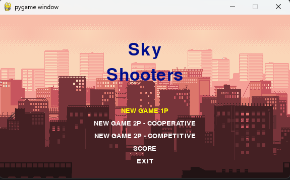
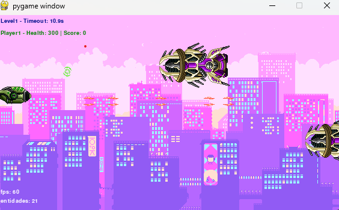
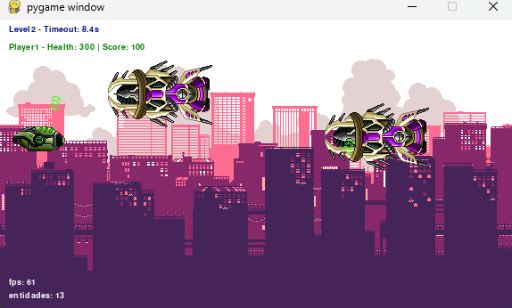
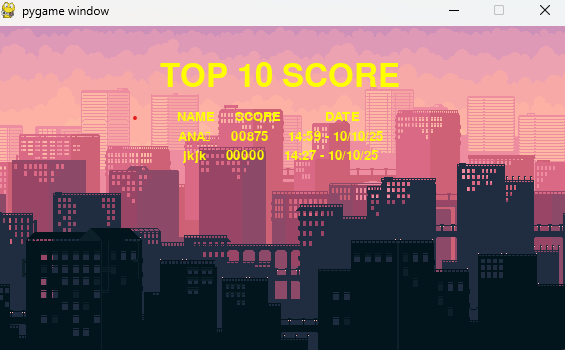

# SkyShooters

## About
SkyShooters is a 2D arcade game developed with **Pygame**.  
The game has **2 levels**, and each level ends with a **timeout event**.  
It can be played in **co-op mode** (2 players).  
Scores are saved in a **SQLite3 database**.

Feel free to contribute if you want!

---

## Game Menu
  

---

## Game Levels

### Level 1
  

### Level 2
  

### Score
  

